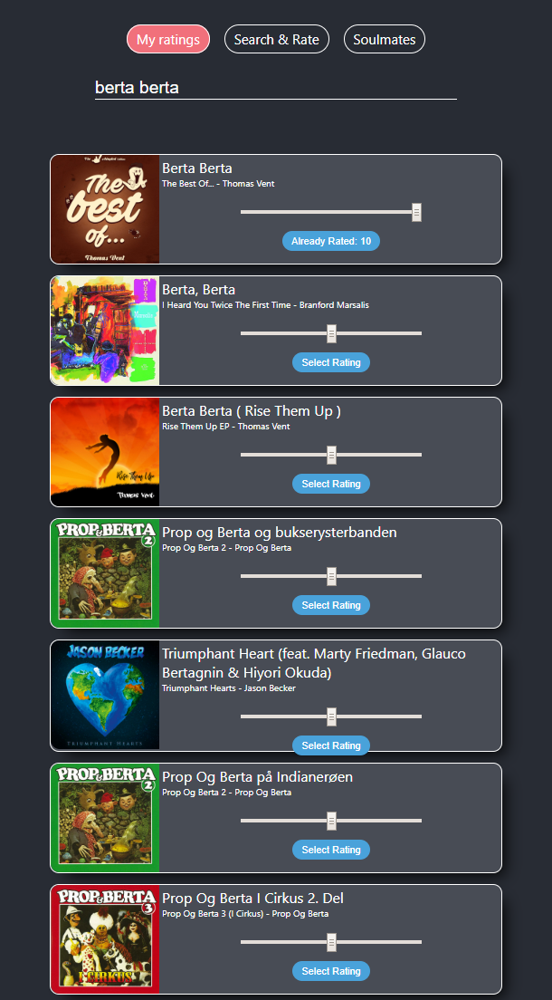

# Ratelist
Web application integrated with Spotify API that lets users give ratings to tracks from Spotify.

## How it Works

1. User arrives at landing page and is asked to log in.
2. After clicking the *Log In* button, user is redirected to the Spotify website for authentication.
3. After authentication, user is redirected back to the app and lands on a *Search and Rate* page.
4. User searches for tracks by typing track or artist name in the search bar.
5. A list of tracks is displayed and the user can give each of them a rating from 1 to 10.
6. When searching for an already rated track, the track's previous rating is displayed and user can update it.

7. The ratings are stored by the application and the user can view a list of all rated tracks on the *My Ratings* page.

## Tech Stack

- React
- Node.js with Express framework
- PostgreSQL with Sequelize ORM
- Spotify API

## Installation

This prodcedure describes how to launch the application in a development or testing environment, with client and server on the same machine. In production environments the client and server would be deployed on different machines.

1. Clone the repository.

2. Run `npm install` in the root of the project, in the *server* directory and the *client* directory.

3. Register your app at [Spotify Developers](https://developer.spotify.com/).

4. For your registered app, specify a redirect URI in the Redirect URIs field. This is the URI on the app server where credentials are sent after successful authentication with the Spotify website. It needs to match the value set in the `SPOTIFY_REDIRECT_URI` environment variable specified in step 5.

5. Set up the following environment variables in your environment, or create a *server/.env* file and specify them in the file:

- `SPOTIFY_CLIENT_ID` - client ID provided for your app by [Spotify Developers](https://developer.spotify.com/)
- `SPOTIFY_CLIENT_SECRET` - client secret key provided for your app by [Spotify Developers](https://developer.spotify.com/)
- `SPOTIFY_REDIRECT_URI` - the URI on the app server where credentials are sent after successful authentication with the Spotify website; this needs to match the value specified in step 4
- `SERVER_PORT` - port on which the backend server is running
- `SERVER_HOST` - host on which the server is running
- `DB_NAME` - name of the database
- `DB_HOST` - host on which the database is running
- `DB_USERNAME` - username used to authenticate to the database
- `DB_PASSWORD` - password for the database user
- `DB_DIALECT` - dialect used by the database
- `TEST_DB_NAME` - name of the testing database instance; used for the creation of testing database tables
- `TEST_DATABASE_URL` - URL of the testing database instance

6. Launch the database.

7. Launch the server by running `node index.js` inside the *server* directory.

8. Launch the client by running `npm start` inside the *client* directory.

9. Enjoy!

## Contributors

- [Virginie Auguste](https://github.com/Sipann)
- [Petr Penicka](https://github.com/ppenicka)

## Credits

This project was forked from Gerard Soldevila's [repository](https://github.com/gsolde/Ratelis).